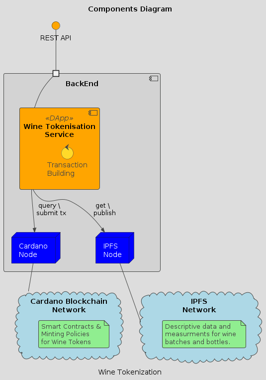

# Wine Supply Chain Tracking and Reporting System 🍷🍇

- [Wine Supply Chain Tracking and Reporting System 🍷🍇](#wine-supply-chain-tracking-and-reporting-system-)
  - [1. Overview](#1-overview)
  - [3. Architecture \& Components](#3-architecture--components)
  - [4. Project Structure](#4-project-structure)
  - [5. Installation \& Setup](#5-installation--setup)
    - [5.1 **Development setup**](#51-development-setup)
  - [6. Operation](#6-operation)
    - [6.1 **Docker setup**](#61-docker-setup)
    - [6.2.  **Configure admin key**](#62--configure-admin-key)
    - [6.3.  **Configure `atlas_config.json`**](#63--configure-atlas_configjson)
  - [7. Usage](#7-usage)
    - [7.1. Deploying validators](#71-deploying-validators)
    - [7.2. Starting the service](#72-starting-the-service)
  - [8. License](#8-license)
  - [9. Contributions, Feedback and Support](#9-contributions-feedback-and-support)
  - [10. Future Milestones](#10-future-milestones)
  - [11. Acknowledgments](#11-acknowledgments)

---

## 1. Overview

This is a component part of a tokenized supply chain tracking and reporting system that wineries and their consumers will use to track the quality of wine.

Both wine collections (batches) and individual bottles are represented on the Cardano blockchain as NFTs in accordance with the CIP-68 standard.
  - A wine collection (batch) is represented on-chain with a set of descriptive attributes specific to the collection and a set of measurements.
  - An individual bottle is represented on-chain with a reference to the collection it is part of, a set of descriptive attributes specific to the bottle, a set of measurements, and a set of inscriptions (representing data/notes specific to the bottle).

The values ​​of the descriptive attributes and measurements are stored on IPFS, where the file structure will contain the current data and the hash of the previous file.

---

## 3. Architecture & Components



> -  **Web Tokensation Service**  Service for management of tokenized wine collections and individual bottles.
> -  **IPFS Node**: Local IPFS Node or IPFS Provider.
> -  **Cardano Node**: Local Cardano node or Cardano Blockchain Provider
---

## 4. Project Structure

```plaintext
.
├── src
|	├──  Admin                          # Administrator cli interface (onchain deployment of validators)
|	├──  Bruno                          # Bruno collection for the REST API.
|	├──  Offchain                       # Offchain logic for transaction building
|	├──  Onchain                        # Cardano smart contracts (spending validators and minting policies)
|	├─── Server                         # Server exposing REST API interface for wine tokens
|	└──  Tests                          # Testing of operations (transactions).
|
├── wine_contract_blueprint.json   		# Blueprint documenting the smart contract 
├── wine_validator.plutus          		# Serialized validator
├── config_atlas.json              		# Atlas configuration file for the blockchain provider
├── payment.key                    		# Admin key
├── config_admin.json              		# Administrator context config file (contains reference script UTxO and admin key)
├── swagger-api             			# Wine API Swagger file
└── README.md                      		# This file

```

## 5. Installation & Setup


### 5.1 **Development setup**

This project uses the [The Developer Experience Shell](https://github.com/input-output-hk/devx/#the-developer-experience-shell) to build a fully-functioning and reproducible Cardano development shell for Haskell quickly and across multiple operating systems (and architectures).


 * After installing and configuring `nix` and `direnv`, clone the repo and type:

 ```
 direnv allow
``` 

 * The test suite for operations (transactions) can be run with the following command:

```
cabal test 
```

## 6. Operation

### 6.1 **Docker setup**

You can pull the docker image for arm64 from here.

```
docker pull mariusgeorgescu/wine-tokenization-service:latest
```

You can pull the docker image for amd64 from here.

```
docker pull mariusgeorgescu/wine-tokenization-service:amd64
```

Also you could build the image yourself with.

```
docker buildx build \
  --platform linux/amd64 \
  -t your-registry/your-image:latest \
  .
```


* A container of this image will start the ipfs daemon and the wine service (with default test configuration) listening on http://0.0.0.0:8082/  (swagger on http://0.0.0.0:8082/swagger-ui)


Eg. of running the server (with default test configuration) and "basicuser" & "basicpass" as user and pass for the Basic Auth

```
docker run -i -p 8082:8082 --name wts mariusgeorgescu/wine-tokenization-service:latest server basicuser basicpass
```

***
### 6.2.  **Configure admin key**
***
  * This service is managed by an owner who pays for the submited transactions fees.  For this purpose, a file named **"payment.skey"**, which should have the following format must exist.

```
{
    "type": "PaymentSigningKeyShelley_ed25519",
    "description": "Payment Signing Key",
    "cborHex": "5820f56ce81846c1d67c939fea0e2c6e8d9693fb5c922ee567c6365561ada1bd45e1"
}

```
 * A new key could be generated using cardano-cli:
```
cardano-cli address key-gen \
    --verification-key-file payment.vkey \
    --signing-key-file payment.skey
```

 * The next step would be to generate a wallet address for the payment key and make sure that funds are available  For tesnets you can use the [Testnet Faucet](https://docs.cardano.org/cardano-testnets/tools/faucet).
```
cardano-cli address build \
    --payment-verification-key-file payment.vkey \
    --out-file payment.addr \
```


***
### 6.3.  **Configure `atlas_config.json`**
***

  * Building transaction bodies requires gathering suitable information from the blockchain.  For this purpose, we'll require a provider. So at the project root directory a file named **"config_atlas.json"**, which should have the following format

```
{
  "coreProvider": {
    "maestroToken": "{YOUR TOKEN HERE}"
  },
  "networkId": "testnet-preview",
  "logging": [
    {
      "type": {
        "tag": "stderr"
      },
      "severity": "Debug",
      "verbosity": "V2"
    }
  ],
  "utxoCacheEnable": true
}
```
 * More info about the provider config can be found [here](https://atlas-app.io/getting-started/endpoints#defining-provider-configuration)


## 7. Usage


***
### 7.1. Deploying validators
***

 * This service requires validators to be deployed and to be used as reference UTxOs in the transactions.  The validators can be deployed with the following command.

```
admin deploy-validator payment.skey
```

* This will output :
	- a file named **"config_admin.json"** which contains the validators reference UTxO and the admin key.
	- a file named **"wine_validator.plutus"** which contains the serialized validator.
	- a file named **"wine_contract_blueprint"** which contains the validator's blueprint.

***
### 7.2. Starting the service
***

 * Once the validators are deployed, the service can be started with the following command:

```
server [-- <user> <pass>]
```
 * This command will start the server listening on http://0.0.0.0:8082/ and serve the swagger on http://0.0.0.0:8082/swagger-ui
 * Optionally if *user* and *pass* arguments are passed, they will be used for the *Basic Authentication* instead of the default values.


## 8. License

See the [LICENSE](LICENSE.md) file for details.


## 9. Contributions, Feedback and Support

We welcome contributions from the community! Your feedback is invaluable!
Use the following channels for support or feedback:

1. Report bugs or suggest features via [GitHub Issues] .
2. Join the Conversation: [GitHub Discussions] .
3. Submit pull requests (PRs) that align with the project’s goals.

## 10. Future Milestones

[Milestones](https://milestones.projectcatalyst.io/projects/1200246)


## 11. Acknowledgments
Thanks to the Cardano community for support.
This project is funded by [F12 - Project Catalyst ID: #1200246 ](https://projectcatalyst.io/funds/12/cardano-use-cases-mvp/wine-supply-chain-tracking-and-reporting-system)

---
